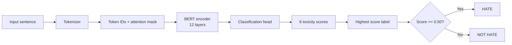

# Local BERT Hate-Speech Chatbot

This repo now contains only a terminal chatbot checker.

## Files

- `terminal_chatbot.js` - interactive CLI for hate/not-hate detection
- `package.json` - dependency list
- `package-lock.json` - locked dependency versions
- `.gitignore` - ignore rules

## Run

1. Install dependencies:

```bash
npm install
```

2. Start chatbot:

```bash
node terminal_chatbot.js
```

Or run with npm script:

```bash
npm run chat
```

3. Type any sentence and press Enter.

4. Type `exit` to quit.

## Notes

- Model used locally: `Xenova/toxic-bert`
- First run downloads model files, so it can take some time.
- After first download, startup is much faster.

## Visualize The Model

To open a visual graph of the ONNX model in your browser:

```bash
npm run visualize:model
```

Netron will start a local viewer and load:

- `node_modules/@huggingface/transformers/.cache/Xenova/toxic-bert/onnx/model.onnx`

To print a presentation-friendly summary:

```bash
npm run model:report
```

## How To Explain It Simply

1. Input sentence is tokenized into IDs.
2. BERT encoder (12 layers) builds contextual meaning.
3. Classification head outputs 6 toxicity scores.
4. App picks the highest score label.
5. If label is toxic-type and score >= 0.50, result is HATE, else NOT HATE.

The six labels are:

- toxic
- severe_toxic
- obscene
- threat
- insult
- identity_hate

## Simple Diagram


